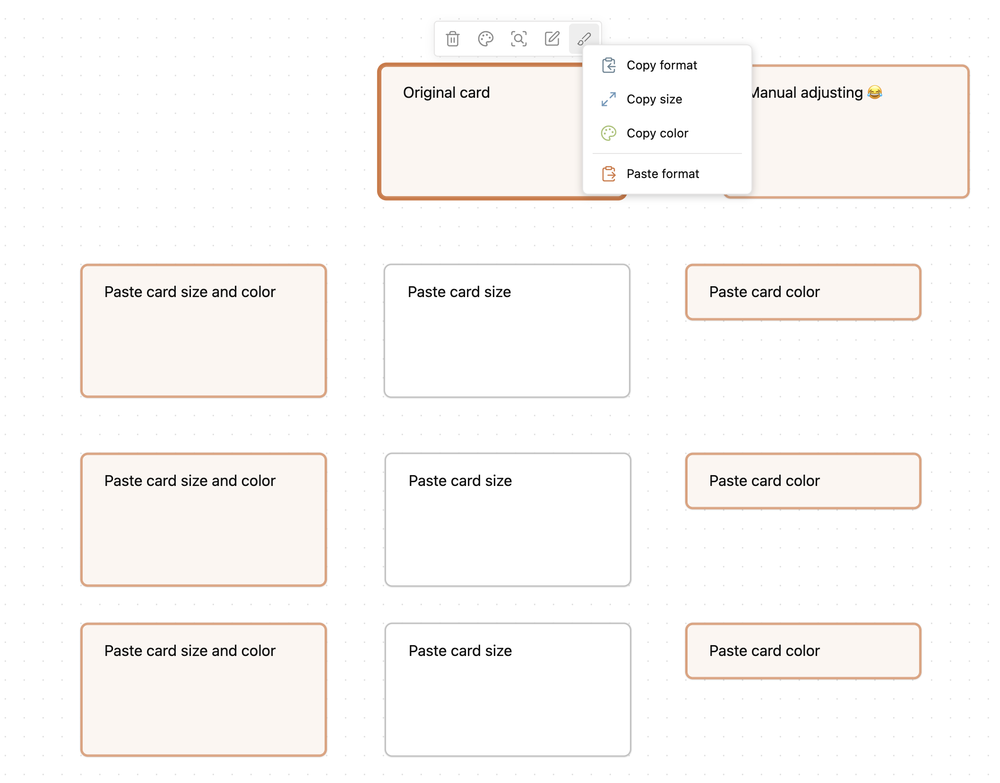

# Canvas Format Brush

 

An [Obsidian](https://obsidian.md/) plugin that allows you to copy and paste formatting attributes (size and color) between canvas elements, similar to the format painter in Word.

## Features

- Copy and paste formatting between canvas elements
- Supports copying:
  - Card size and color
  - Card size only
  - Card color only
- Context menu and commands
- Status bar indicator showing when format is copied

## Videos

## Commands

- **Copy format**: Copies all formatting attributes from the currently selected canvas element
- **Copy size**: Copies only size attributes from the selected canvas element
- **Copy color**: Copies only color attributes from the selected canvas element
- **Paste format**: Applies the copied formatting to all currently selected canvas elements

## How to Use

1. Click on a canvas element you want to copy formatting from
2. Select the Format Brush icon from the canvas context menu
3. Choose from the submenu options:
   - **Copy format**: Copy all formatting attributes
   - **Copy size**: Copy only the size attributes
   - **Copy color**: Copy only the color attributes
   - **Paste format**: Apply the copied formatting (appears after copying)
4. To paste, select one or more canvas elements, and select the Format Brush icon, and choose "Paste format"

You can also use the commands from the command palette for keyboard shortcuts.

## Settings

You can customize which formatting attributes are copied:

- **Copy color**: Enable/disable copying of the card color
- **Copy size**: Enable/disable copying of the card size

Additional settings:

- **Show status bar item**: Show/hide the format brush status in the status bar

## Installation

### From Obsidian

1. Open Settings in Obsidian
2. Go to Community Plugins and turn off Safe Mode
3. Click Browse and search for "Canvas Format Brush"
4. Install the plugin and enable it

### Manual Installation

1. Download the latest release from the releases page
2. Extract the zip file into your Obsidian vault's `.obsidian/plugins` folder
3. Enable the plugin in Obsidian's Community Plugins settings

## Support me

